# Figure-by-Figure Analysis — Symmetric Baseline via the Asymmetric Code

This document analyzes every figure in `asymetric_symetric_figs/`. All figures
were produced by the **asymmetric switching code** run in its **symmetric limit**
(`eps_p = eps_m`, so the stationary high-state probability
`g* = ε₊/(ε₊+ε₋) = ½`). They therefore serve two purposes at once:

1. They **reproduce the symmetric results** of Kim, Kilpatrick & Josić,
   *"Daring few, patient many: division of labor in decentralized foraging
   collectives,"* validating that the asymmetric generalization collapses
   exactly to the original model when the two directional rates are equal.
2. They fix the **reference baseline** against which any future asymmetric sweep
   (`g* ≠ ½`) will be compared.

For the code changes themselves and their downstream implications, see
[`SYMMETRIC_VS_ASYMMETRIC.md`](SYMMETRIC_VS_ASYMMETRIC.md) and the theory note
[`docs/asymetric_switch.pdf`](../../docs/asymetric_switch.pdf).

Throughout, the critical belief is `θ_c ≈ 0.70`, the point at which committing is
worth the risk under the default reward/cost parameters.

---

## Main figures

### Figure 2 — Normative optimal policy

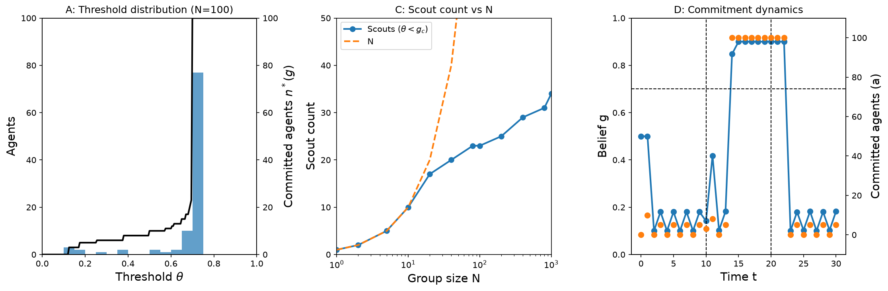

Figure 2 establishes the paper's central object: the optimal collective policy
and the threshold distribution it induces. **Panel A** overlays the emergent
distribution of the 100 agents' commitment thresholds (blue bars) on the optimal
committed-count policy `n*(g)` (black curve). The distribution is sharply
skewed — roughly 77 agents pile into a single bar just below the critical belief
(θ ≈ 0.70–0.75), a smaller cluster sits at θ ≈ 0.65, and a thin tail of a *few*
agents scatters across low thresholds (θ ≈ 0.1–0.6). This is the "daring few,
patient many" split made concrete: a small scout cohort with low thresholds that
probes the environment, and a large committed majority pinned just under `θ_c`.
The policy `n*(g)` is correspondingly step-like, jumping from near-zero to full
commitment (100) at g ≈ 0.70. **Panel C** shows scout count against group size N
on a log x-axis: the scout curve tracks the identity line `N` only up to N ≈ 10,
then bends sharply below it, growing sublinearly (≈17 at N=20, ≈23 at N≈100, ≈34
at N=1000) — the first visual signature of the `O(log N)` scaling theorem.
**Panel D** is a dynamic trace: under a prescribed "good" window (t = 11–20,
bracketed by dashed lines), belief oscillates in a low sawtooth with almost no
commitment while scouts probe, then spikes across `θ_c`, triggers en-masse
commitment (a → ~100, belief locks near 0.9), and collapses back to the scouting
regime once the window ends. Together the panels show the collective rapidly
detecting, exploiting, and disengaging from a transient good state — decentralized
consensus that tracks the environment. In the symmetric limit shown here, belief
relaxes to ½ between observations; this is exactly the anchor that `g*` replaces
under asymmetry.

### Figure 3 — Perturbation of the optimal policy

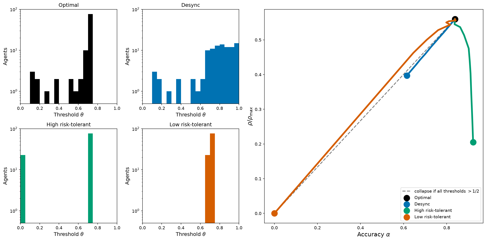

Figure 3 asks what happens when the optimal threshold distribution is
deliberately perturbed, comparing four policies (Optimal = black, Desync = blue,
High risk-tolerant = green, Low risk-tolerant = orange). The four small
histograms (left) show the threshold distributions: **Optimal** is right-weighted
with a dominant peak at θ ≈ 0.7 (mirroring Fig 2A); **Desync** smears mass across
the high range θ ≈ 0.6–1.0; **High risk-tolerant** is bimodal and extreme — ~23
bold explorers at θ ≈ 0.03 plus ~75 committers at θ ≈ 0.72; **Low risk-tolerant**
collapses to a single cluster near θ ≈ 0.65–0.72 with *no* low-threshold
explorers at all. The large right panel plots each policy in the
accuracy (α) versus normalized return (ρ/ρ_max) plane. The optimal policy sits at
the Pareto-best corner (ρ/ρ_max ≈ 0.56 at α ≈ 0.83). The perturbations reveal the
trade-off structure: the high risk-tolerant policy achieves the *highest*
accuracy (α ≈ 0.93) but its return collapses to ≈0.20 — accuracy bought at a
severe return cost — while the low risk-tolerant policy's curve runs all the way
down to the origin. The gray dashed diagonal, labeled "collapse if all thresholds
> 1/2," marks the starvation trap: when nobody explores, both return and accuracy
go to zero. The takeaway is that the optimum is a genuine maximum of *return*, not
of accuracy, and that removing the scout cohort (pushing every threshold above ½)
is catastrophic. This ½ boundary is precisely the quantity that the asymmetric
model generalizes to `g*`, so the trap line would tilt under unequal switching
rates.

### Figure 4 — Heterogeneity across parameter space

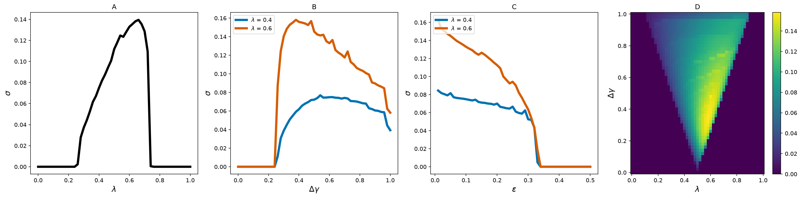

Figure 4 maps where division of labor actually emerges, using σ (the dispersion
of the optimal threshold distribution) as the order parameter. **Panel A** sweeps
the cost λ: σ is zero until λ ≈ 0.25, rises steeply to a peak of ≈0.14 near
λ ≈ 0.65, then drops back to zero by λ ≈ 0.75 — heterogeneity lives only in an
intermediate cost window. **Panel B** sweeps the reward gap Δγ for two λ values:
both curves are flat until Δγ ≈ 0.22, then jump up, with λ = 0.6 sustaining more
heterogeneity (peak ≈0.157) than λ = 0.4 (peak ≈0.075) — a larger reward gap
drives more division of labor. **Panel C** sweeps the switching rate ε: σ starts
high at small ε and falls off a cliff to zero at ε ≈ 0.32–0.34, i.e. fast
environmental switching destroys heterogeneity entirely. **Panel D** is the 2D
(λ, Δγ) heatmap: a bright wedge of high σ points down toward (λ ≈ 0.5, Δγ ≈ 0.05)
and widens upward, brightest along λ ≈ 0.55–0.65 for mid-to-high Δγ, with σ ≈ 0
everywhere outside. The unifying message is that threshold heterogeneity — the
scout/committer split — is not generic: it requires intermediate cost
(λ ≈ 0.5–0.7), a sufficiently large reward gap, and a slow-enough environment.
Panel C is the most directly asymmetry-relevant: because ε sets the reachable
belief band `[ε, 1−ε]` (which becomes `[ε₊, 1−ε₋]` under asymmetry), the ε at
which heterogeneity vanishes is exactly where the critical belief exits the
feasible band — the mechanism the asymmetric feasibility wedge (`is_valid`)
generalizes.

---

## Supplementary figures

### Figure S1 — Genetic-algorithm validation

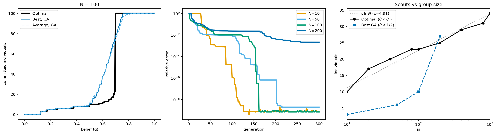

Figure S1 confirms that an evolutionary search *independently rediscovers* the
analytically optimal policy, rather than the optimum being an artifact of the
Bellman solver. **Panel 1** overlays the optimal policy (thick black step at
g ≈ 0.70) with the GA's best (blue) and population-average (sky) policies; the GA
curves track the optimal threshold structure closely, with only a softer
transition, and best ≈ average indicates the population has converged. **Panel 2**
plots relative error against generation on a log y-axis for four group sizes:
small N converges fastest and deepest (N=10 reaches ~10⁻⁸ by generation ~110),
while N=200 plateaus far higher (~2×10⁻³) and never bottoms out within 300
generations — the policy space grows harder to optimize as N increases. **Panel
3** compares scout count against a `c·ln N` reference (c = 4.91): the optimal
scout count (black) hugs the logarithmic reference from ~10 at N=10 to ~34 at
N=1000, directly confirming the `O(log N)` scaling theorem, while the GA's best
count recovers a similar magnitude. This figure is important validation: two
different optimizers (value iteration and a GA) agree on both the policy shape and
the logarithmic scout scaling.

### Figure S2 — Scout scaling with N across parameters

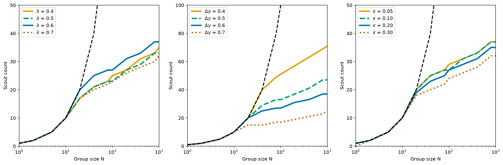

Figure S2 stress-tests the `O(log N)` scaling by varying each parameter in turn;
all three panels plot scout count against N on a log x-axis, with the dashed
`y = N` "all-scouts" reference. **Panel A (varying λ)** shows the curves peel away
from the linear reference beyond N ≈ 10 and saturate at ~30–37 scouts by N=1000,
with only weak, non-monotone dependence on cost. **Panel B (varying Δγ)** shows
the strongest effect: a small reward gap (Δγ = 0.4) keeps the scout count nearly
linear (~71 at N=1000), while a large gap (Δγ = 0.7) suppresses it to ~24 — the
reward gap is the dominant driver of how many scouts the collective can afford.
**Panel C (varying ε)** shows tight clustering: the switching rate barely moves
the scout count (faster switching only mildly suppresses it). The consolidated
message is that sublinear (logarithmic) scout scaling is robust across the whole
parameter range — it is a structural property of the collective, not a
fine-tuned coincidence — and that Δγ, not λ or ε, sets its magnitude. As in Fig 4
Panel C, the mild ε-dependence here is the symmetric shadow of the asymmetric
feasibility band `[ε₊, 1−ε₋]`.

### Figure S3 — Threshold cumulative distribution

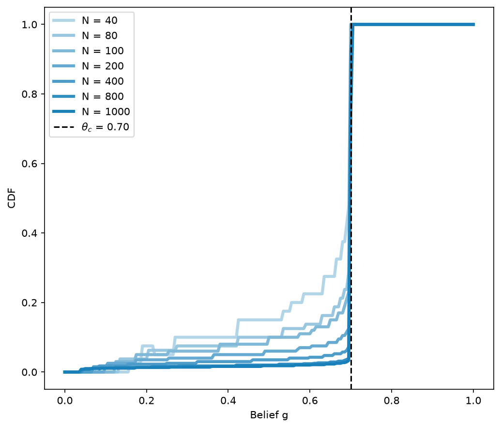

Figure S3 sharpens the "patient many" picture using the CDF of agent thresholds
for seven group sizes (N = 40 → 1000, light → dark), with `θ_c = 0.70` marked by a
dashed vertical line. Every CDF stays very low across the whole belief range and
then jumps almost vertically to 1.0 exactly at `θ_c` — meaning the overwhelming
majority of agents have thresholds pinned right at the critical belief. The small
pre-step accumulation is the scout fraction, and it *shrinks with N*: the N=40
curve reaches ~0.20–0.25 before the step, while N=1000 barely reaches ~0.05. This
is the cumulative-distribution view of the same sublinear scaling seen in Figs 2C,
S1, and S2 — larger groups devote a proportionally smaller share to scouting — and
it makes the bimodal "daring few / patient many" structure visually unambiguous.

### Figure S4 — Response-time asymmetry

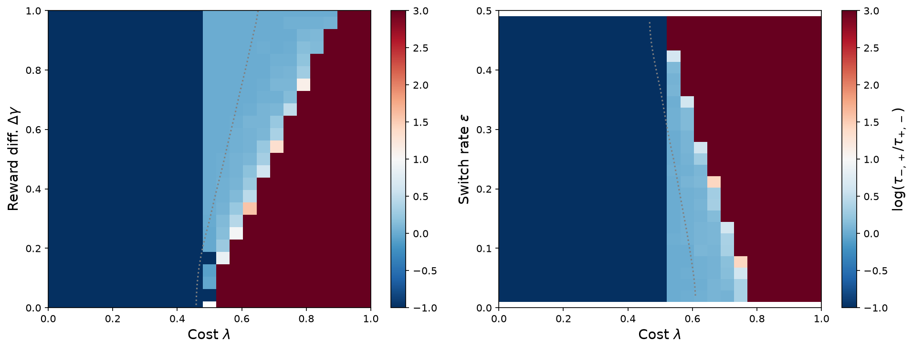

Figure S4 examines the two directions of environmental switching separately via
`log(τ₋,₊ / τ₊,₋)`, the log-ratio of response times for good→bad versus bad→good
transitions, over two parameter planes (diverging colormap, gray zero-contour
marking where the two response times are equal). In **Panel 1 (λ × Δγ)** the plane
splits into a dark-blue floor (log-ratio −1) at low cost and a saturated dark-red
region (+3) at high cost, with the zero-contour rising diagonally — so larger
reward gaps push the crossover to higher cost. **Panel 2 (λ × ε)** has the same
structure but the zero-contour slopes the opposite way: faster switching *lowers*
the cost threshold at which the asymmetry flips sign. The response-time asymmetry
is therefore governed primarily by cost λ, with Δγ and ε shifting the transition
boundary in opposite directions. This figure is conceptually the closest to the
asymmetric extension: even in the symmetric limit the two switch *directions*
already have distinct response times as a function of λ; under true asymmetry
(`ε₊ ≠ ε₋`) the dwell distributions themselves differ (`geometric(ε₋)` vs
`geometric(ε₊)`), which would directly bias this log-ratio.

### Figure S5 — Perturbation performance across N

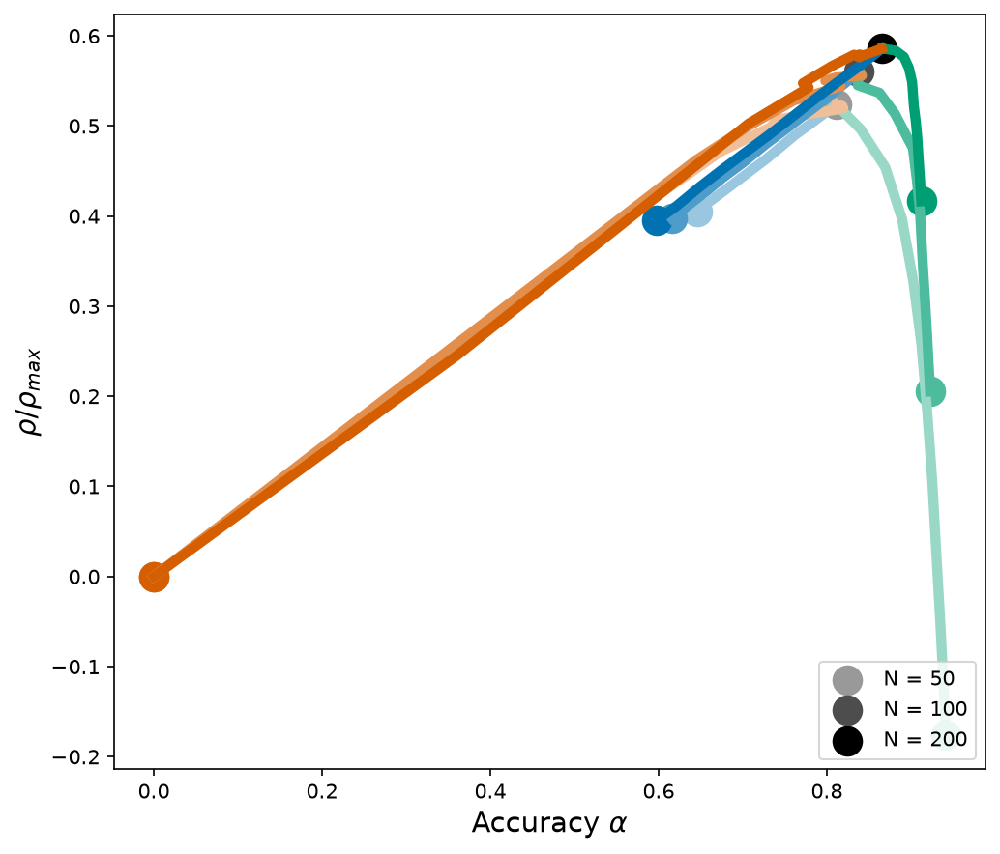

Figure S5 repeats the accuracy-versus-return trade-off of Fig 3 across three
population sizes (N = 50, 100, 200; lightest → darkest). The return curve rises
almost linearly from the origin (the fully cautious deliberator limit), reaches a
broad hump of ρ/ρ_max ≈ 0.55–0.59 at intermediate accuracy α ≈ 0.82–0.87, then
falls steeply on the over-accurate side. Crucially, the three N brightnesses
nearly overlap on the rising limb, so the trade-off — and the location of the
optimum at *intermediate* accuracy — is essentially population-size-invariant.
The only material N-dependence is on the steep right flank, where over-committing
collapses return far below zero for N=50 but is cushioned (staying ≈+0.2) for
N=200. The message reinforces Fig 3: maximizing accuracy is not the goal;
returns peak at an intermediate accuracy achieved by keeping a scout cohort, and
this optimum is robust to group size.

### Figure S6 — Heterogeneity across N

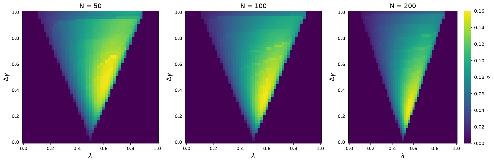

Figure S6 re-plots the (λ, Δγ) heterogeneity heatmap of Fig 4D for three
population sizes (N = 50, 100, 200). All three show the same triangular wedge of
nonzero σ, apex near (λ ≈ 0.5, Δγ ≈ 0) opening upward, brightest along
λ ≈ 0.55–0.7, with homogeneity (σ = 0) everywhere outside. The wedge is
qualitatively N-invariant but *sharpens* with N: at N=50 the high-σ zone is broad,
while at N=200 it condenses into a tighter, more sharply bounded vertical band.
This is consistent with a well-defined phase boundary in the large-N limit — the
division-of-labor region does not move or disappear as the group grows, it simply
crystallizes. Combined with S5, this shows both the performance optimum and the
heterogeneity region are structurally stable across population size.

### Figure S7 — Partial-communication performance

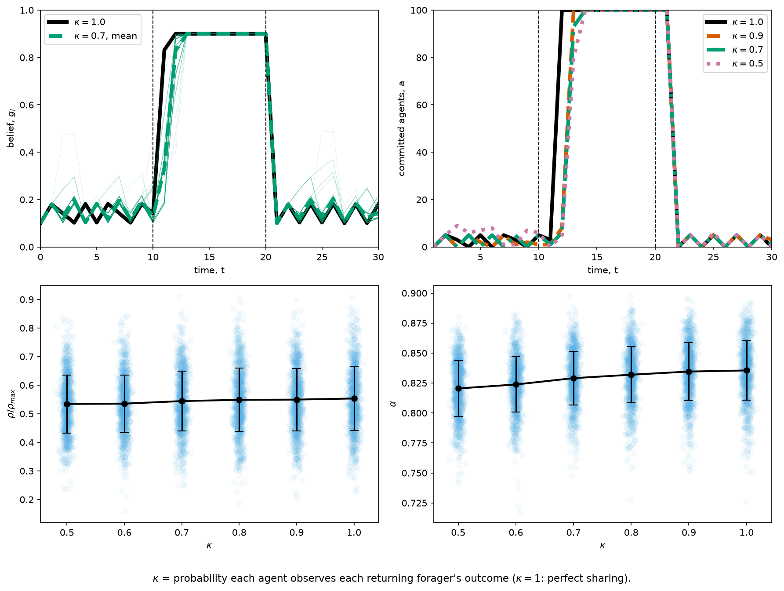

Figure S7 relaxes the perfect-information assumption: κ is the probability that
each agent observes each returning forager's outcome (κ = 1 is full sharing).
**Panel A** shows mean belief for κ = 1.0 (black) and κ = 0.7 (green) tracking each
other closely through a bad→good→bad cycle, with κ = 0.7 only slightly slower and
noisier. **Panel B** shows committed-agent count for κ = 1.0, 0.9, 0.7, 0.5: all
reach full commitment after the good state begins, with lower κ lagging by only
1–2 time steps. **Panel C (return vs κ)** shows the mean rising only marginally
(≈0.53 → ≈0.55 from κ = 0.5 to 1.0), dwarfed by run-to-run scatter, and **Panel D
(accuracy vs κ)** shows a modest monotone increase (≈0.821 → ≈0.836). The
headline is robustness: even when each agent sees only half the outcomes
(κ = 0.5), the collective still reaches full commitment and near-full return.
Degrading communication produces graceful, gradual loss — not collapse — which is
a strong argument for the decentralized design.

### Figure S7b — Scout count vs sharing probability κ

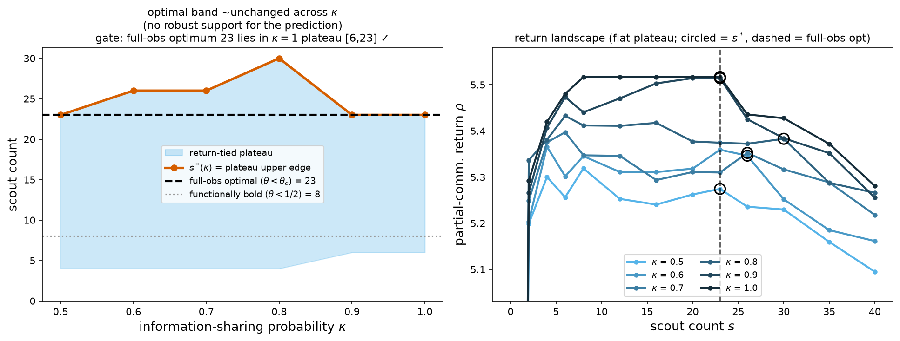

Figure S7b is the one figure that *departs from the paper's prediction*, and it is
worth flagging clearly. The paper predicts that worse information sharing (smaller
κ) should require *more* scouts to compensate. The **left panel** plots the
optimal scout count `s*(κ)` (vermillion) with its statistically return-tied
plateau (blue band), against the full-observation optima (dashed 23 for θ < θ_c,
dotted 8 for θ < ½). Instead of rising as κ falls, `s*(κ)` is non-monotonic and
roughly flat — 23 at κ = 0.5, peaking at 30 at κ = 0.8, back to 23 at κ = 1.0 —
and the title records the verdict: "optimal band ~unchanged across κ (no robust
support for the prediction)." The **right panel** explains why: the return
landscape ρ(s) for each κ (light → dark blue for κ = 0.5 → 1.0) is very *flat*
over a wide plateau (roughly s from single digits to ~23), so the argmax is a
broad statistically-tied band rather than a sharp point. Lower κ shifts the whole
landscape *down* (less return overall) but does not move the optimal scout band.
In other words, imperfect sharing costs return but does not demand a larger scout
cohort — the flatness of the return landscape absorbs the change. This is a
genuine, reproducible deviation from the paper's stated expectation and is the
natural starting point for the asymmetric investigation, where re-anchoring the
belief relaxation at `g* ≠ ½` could plausibly restore (or further break) the
predicted κ-dependence.

---

## Summary

| Theme | Figures | What the symmetric baseline shows |
|-------|---------|-----------------------------------|
| Optimal policy & "daring few, patient many" | 2, S1, S3 | Bimodal thresholds: small scout cohort + majority pinned at `θ_c ≈ 0.70` |
| `O(log N)` scout scaling | 2C, S1(3), S2, S3 | Scout count grows logarithmically; Δγ sets its magnitude |
| Accuracy–return trade-off | 3, S5 | Return peaks at *intermediate* accuracy; robust to N |
| Heterogeneity / division-of-labor region | 4, S6 | Emerges only in an intermediate-λ, high-Δγ, low-ε wedge; sharpens with N |
| Response-time asymmetry | S4 | Governed by cost λ; Δγ and ε shift the crossover oppositely |
| Communication robustness | S7 | Graceful degradation down to κ = 0.5 |
| **Deviation from paper** | **S7b** | Optimal scout count does *not* rise as sharing degrades (flat return landscape) |

All figures were generated by the asymmetric code with `eps_p = eps_m`, so they
reproduce the symmetric baseline exactly (deterministic paths bit-exact, MC paths
within noise). The panels most sensitive to the asymmetric generalization —
Fig 4C (ε and the feasibility band), Fig S4 (directional dwell times), and
Fig S7b (the scout/κ deviation) — are the recommended targets for the first
`g* ≠ ½` sweep.
